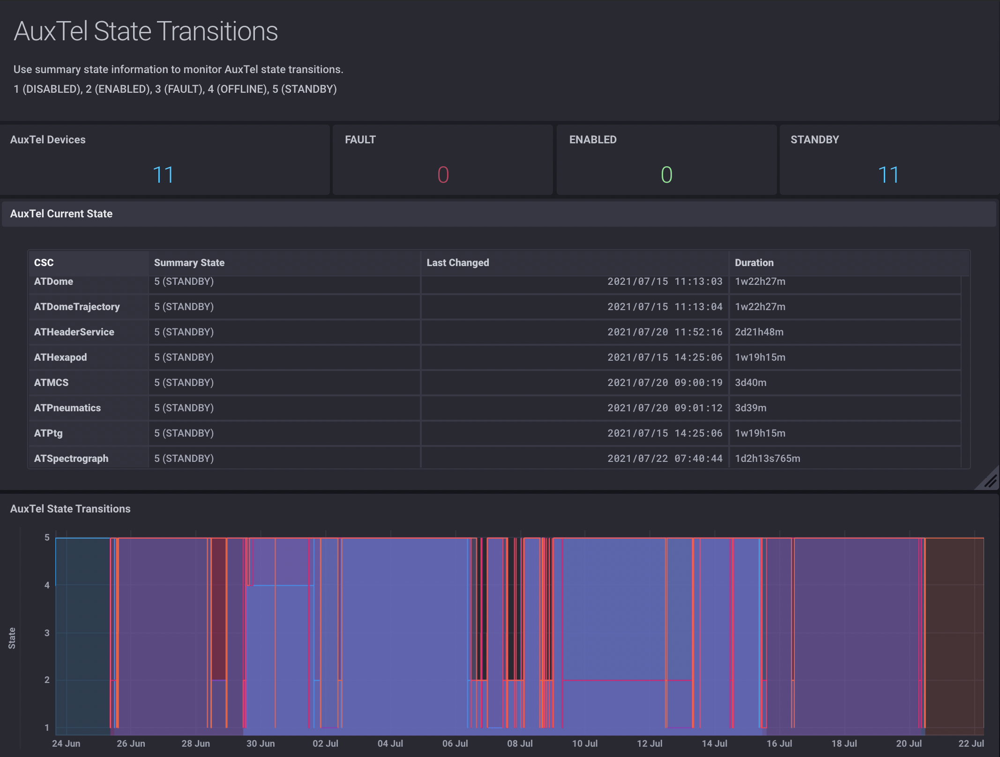
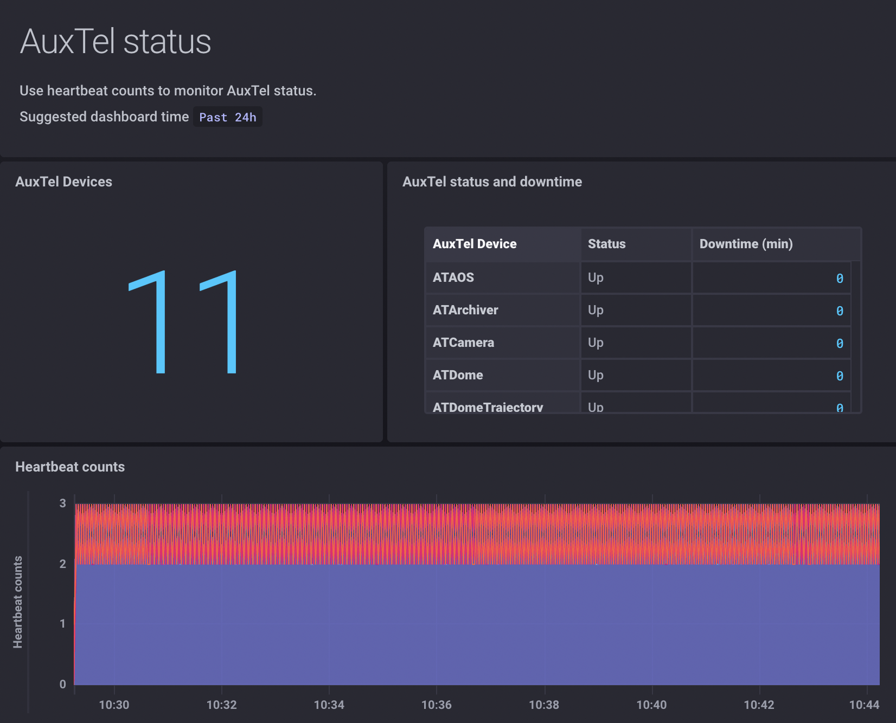

# Flux tranning

Material for InfluxData Flux training

## Introduction

See slides for an [introduction to Rubin Observatory Engineering data](https://docs.google.com/presentation/d/1IKkXgbv779qJSFCCzP-NYrVARHqnjuoP-X4f1eT8HFs/edit?usp=sharing).

## Problem 1: Monitoring Sate Transitions

With multiple devices running simultaneously at Rubin Observatory *Monitoring State Transitions* help astronomers and engineers
to understand in which state a device is and how it responds to commands executed by the Observatory Control System.

Each device can be in one of the following states:

```noformat
DISABLED = 1
ENABLED = 2
FAULT = 3
OFFLINE = 4
STANDBY = 5
```

You’ll work with a dataset comprising one month of data from the Rubin Observatory Auxiliary Telescope (AuxTel).

This data was recorded to the Rubin Observatory Engineering database in June/July 2021, only a few months after the Rubin staff resumed testing and integration activities at the Observatory in Chile due to the pandemic.

The summary state data is organized in 11 [annotated CSV files](https://www.influxdata.com/blog/tldr-tech-tips-how-to-interpret-an-annotated-csv/), each file has data for a different AuxTel device.

Create a bucket called “auxtel” and import the following annotated CSV files to [InfluxDB Cloud](https://cloud2.influxdata.com). In the end you’ll have one InfluxDB measurement with summary state data for each one of the AT devices listed below:

- `ATAOS.logevent_summaryState.csv` (AuxTel Active Optics System)
- `ATArchiver.logevent_summaryState.csv` (AuxTel Data Archiver)
- `ATCamera.logevent_summaryState.csv` (AuxTel Camera)
- `ATDome.logevent_summaryState.csv` (AuxTel Dome Controller)
- `ATDomeTrajectory.logevent_summaryState` (AuxTel Dome)
- `ATHeaderService.logevent_summaryState.csv` (AuxTel Header Service)
- `ATHexapod.logevent_summaryState.csv` (AuxTel Hexapod)
- `ATMCS.logevent_summaryState.csv` (AuxTel Mount Control System)
- `ATPneumatics.logevent_summaryState.csv` (AuxTel Pneumatics)
- `ATPtg.logevent_summaryState.csv` (AuxTel Pointing Component)
- `ATSpectrograph.logevent_summaryState.csv` (AuxTel Spectrograph)

### Constructing the AuxTel State Transitions dashboard




Goals:

- Combine data from multiple InfluxDB measurements (summary state data)
- Map the numerical state values to their meaning.
- Make calculations with timestamps and format strings to make useful dashboards.

That demonstrates some of the Flux capabilities that help you to make advanced dashboards.


#### AuxTel Current State

Suggestion: walk through the code that creates the “AuxTel Current State” table.

Flux is good for querying and combining fields from multiple InfluxDB measurements, something that's not possible with InfluxQL for example.

You can do that by using a regular expression to filter the desired measurements and fields:

```flux
from(bucket: “auxtel”)
  |> range(start: -inf)
  |> filter(fn: (r) => r._measurement =~ /AT.*.logevent_summaryState/ and (r._field == "summaryState"))
```

here you are querying the `auxtel` bucket and using the `filter()` function to get the `summarySate` field from all the `AT.*.logevent_summaryState` measurements.

Think about this as data flowing through the `|>` pipe forward operators.

At each stage Flux creates a table in memory. In this example, the resulting tables have the `summaryState` values for each device and for all times.

To get the _current state_ of each device you can use the `last()` function.

This produces tables with the last point from each measurement. The `_time` column now has the last time the state changed for each device.

```flux
from(bucket: "auxtel")
  |> range(start: -inf)
  |> filter(fn: (r) => r._measurement =~ /AT.*.logevent_summaryState/ and (r._field == "summaryState"))
  |> last()
```

Flux is an extensible language and there are many Flux packages out there ready for use.

Here you are going to import the `strings` package for string manipulations. You’ll extract the device name from the measurement name, use the `map()` function to apply that transformation to every row in the table, and create a new column `device` to hold the device name:

```flux
import "strings"

from(bucket: "auxtel")
  |> range(start: -inf)
  |> filter(fn: (r) => r._measurement =~ /AT.*.logevent_summaryState/ and (r._field == "summaryState"))
  |> last()
  |> map(fn: (r) => ({
    r with
    device: strings.split(v: r._measurement, t: ".")[2]
  })
)
```

where `r._measurement` is the value of the `_measurement` column for a given row.

Now, you’ll add the `state` column to translate the numerical value of each state to its meaning:

```flux
import "strings"

from(bucket: "auxtel")
  |> range(start: -inf)
  |> filter(fn: (r) => r._measurement =~ /AT.*.logevent_summaryState/ and (r._field == "summaryState"))
  |> last()
  |> map(fn: (r) => ({
    r with
    device: strings.split(v: r._measurement, t: ".")[2],
    state:
      if r._value == 5 then "5 (STANDBY)"
      else if r._value == 4 then "4 (OFFLINE)"
      else if r._value == 3 then "3 (FAULT)"
      else if r._value == 2 then "2 (ENABLED)"
      else if r._value == 1 then "1 (DISABLED)"
      else "UNKNOWN"
  )}
)
```

Another area where Flux is great is in performing calculations on fields, there are many functions built in the language already. In particular, you can make calculations with timestamps, also something that is not possible with InfluxQL.

To demonstrate that, let’s use the `duration()` function to compute the duration of the current state. You’ll format the output to a time string with the approximated duration in minutes.

```flux
import "strings"

from(bucket: "auxtel")
  |> range(start: -inf)
  |> filter(fn: (r) => r._measurement =~ /AT.*.logevent_summaryState/ and (r._field == "summaryState"))
  |> last()
  |> map(fn: (r) => ({
    r with
    device: strings.split(v: r._measurement, t: ".")[2],
    state:
      if r._value == 5 then "5 (STANDBY)"
      else if r._value == 4 then "4 (OFFLINE)"
      else if r._value == 3 then "3 (FAULT)"
      else if r._value == 2 then "2 (ENABLED)"
      else if r._value == 1 then "1 (DISABLED)"
      else "UNKNOWN",
    state_duration: strings.splitAfter(v: string(v: duration(v: uint(v: now()) - uint(v: r._time))), t: "m")[0]
   })
  )
  |> keep(columns: ["device", "state", "_time", "state_duration"])
```

Finally, use the `keep()` function to keep only the columns of interest in the final table.

#### AuxTel single stats

Suggestion: can be left as an exercise.

Add single stat cells to summarize the following information:

- Number of AuxTel devices

```flux
from(bucket: "auxtel")
  |> range(start: -inf)
  |> filter(fn: (r) => r._measurement =~ /AT.*.logevent_summaryState/ and (r._field == "summaryState"))
  |> last()
  |> group()
  |> count()
```

- Number of AuxTel devices in `FAULT` state

```flux
// FAULT = 3
from(bucket: "auxtel")
  |> range(start: -inf)
  |> filter(fn: (r) => r._measurement =~ /AT.*.logevent_summaryState/ and (r._field == "summaryState"))
  |> last()
  |> map(fn: (r) => ({
    r with
    state_count:
      if r._value == 3 then 1 else 0
    })
  )
  |> group()
  |> sum(column: "state_count")
```

- Number of AuxTel devices in `ENABLED` state

```flux
// ENABLED = 2
from(bucket: "auxtel")
  |> range(start: -inf)
  |> filter(fn: (r) => r._measurement =~ /AT.*.logevent_summaryState/ and (r._field == "summaryState"))
  |> last()
  |> map(fn: (r) => ({
    r with
    state_count:
      if r._value == 2 then 1 else 0
    })
  )
  |> group()
  |> sum(column: "state_count")
```

- Number of AuxTel devices in `STANDBY` state

```flux
// STANDBY = 5
from(bucket: "auxtel")
  |> range(start: -inf)
  |> filter(fn: (r) => r._measurement =~ /AT.*.logevent_summaryState/ and (r._field == "summaryState"))
  |> last()
  |> map(fn: (r) => ({
    r with
    state_count:
      if r._value == 5 then 1 else 0
    })
  )
  |> group()
  |> sum(column: "state_count")
```

#### Visualizing state transitions

Suggestion: can be left as an exercise.

- Make a step-plot to visualize state transitions

```flux
from(bucket: "auxtel")
  |> range(start: dashboardTime)
  |> filter(fn: (r) => r._measurement =~ /AT.*.logevent_summaryState/ and (r._field == "summaryState"))
  |> map(fn: (r) => ({
    r with
    device: strings.split(v: r._measurement, t: ".")[2],
    state: r._value
  }))
  |> group(columns: ["device"])
  |> keep(columns: ["_time", "device", "state"])
```

## Problem 2: Monitoring Downtime



Goals:

- Combine heartbeats from multiple devices in a single Flux script to monitor their status.
- Aggregate heartbeat counts in windows of 1 minute using the `aggregateWindow()` function.
- Use `stateCount()` to compute downtime.
- Map the numerical status to Up or Down and keep only the columns that matter in the final table.

## Problem 3: Combining data from external sources

## References

- [Flux documentation](https://docs.influxdata.com/influxdb/v2.0/query-data/get-started/)
- [Annotated CSV files](https://www.influxdata.com/blog/tldr-tech-tips-how-to-interpret-an-annotated-csv/)